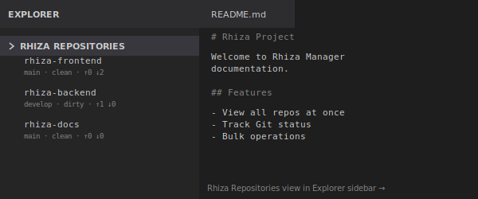
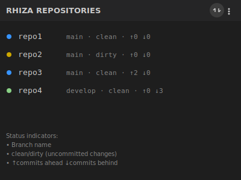
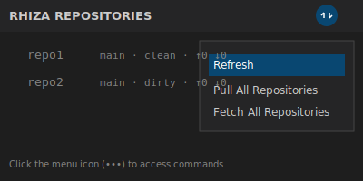
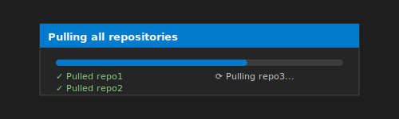

# Rhiza Manager

A Visual Studio Code extension for managing multiple Rhiza-based Git repositories in your workspace. View the status of all your repositories at a glance and perform bulk operations like pull and fetch across all repos.



## Features

### 📊 Repository Status View

The extension adds a "Rhiza Repositories" view to your Explorer sidebar that displays all Git repositories in your workspace with their current status:



For each repository, you can see:
- **Repository name** - The folder name of the repository
- **Current branch** - The active Git branch
- **Clean/Dirty status** - Whether there are uncommitted changes
- **Commits ahead/behind** - How many commits you are ahead (↑) or behind (↓) the remote branch

### 🔄 Refresh Repository Status

Click the refresh icon (🔄) in the view title to update the status of all repositories.



### ⬇️ Pull All Repositories

Use the "Pull All Repositories" command to pull changes from the remote for all repositories in your workspace. The extension shows a progress notification as it processes each repository.



### 🔄 Fetch All Repositories

Use the "Fetch All Repositories" command to fetch updates from the remote for all repositories without merging them. This allows you to see what changes are available without modifying your working directory.

## Getting Started

1. **Install the extension** from the VS Code Marketplace
2. **Open a workspace** containing multiple Git repositories (each repository should be a direct subfolder of your workspace root)
3. **View your repositories** in the "Rhiza Repositories" section of the Explorer sidebar
4. **Use the commands** from the view menu (three dots) or toolbar icons

## Requirements

- Visual Studio Code version 1.107.0 or higher
- Git must be installed and available in your PATH
- Your workspace should contain one or more Git repositories as direct subfolders

## Commands

This extension contributes the following commands:

- `Refresh` - Refresh the repository status view
- `Pull All Repositories` - Pull changes from remote for all repositories
- `Fetch All Repositories` - Fetch updates from remote for all repositories

You can access these commands by:
- Clicking the icons in the "Rhiza Repositories" view toolbar
- Right-clicking in the "Rhiza Repositories" view
- Using the Command Palette (Ctrl+Shift+P / Cmd+Shift+P)

## How to Use

### Setting Up Your Workspace

For the extension to work properly, your workspace should be organized with Git repositories as direct subfolders:

```
workspace-root/
├── repo1/
│   └── .git/
├── repo2/
│   └── .git/
└── repo3/
    └── .git/
```

### Viewing Repository Status

1. Open VS Code with a workspace containing multiple Git repositories
2. Look for the "RHIZA REPOSITORIES" section in the Explorer sidebar
3. Each repository will show its name and status information

### Refreshing Status

- Click the refresh icon (🔄) in the view toolbar
- Or use the Command Palette: "Refresh"

### Pulling All Repositories

1. Click the "Pull All Repositories" button in the view menu (three dots)
2. Watch the progress notification as each repository is pulled
3. The view will automatically refresh when complete

### Fetching All Repositories

1. Click the "Fetch All Repositories" button in the view menu (three dots)
2. Watch the progress notification as each repository is fetched
3. The view will automatically refresh to show updated ahead/behind counts

## Status Indicators Explained

- **Branch name** (e.g., `main`, `develop`) - The current Git branch
- **clean** - No uncommitted changes in the working directory
- **dirty** - There are uncommitted changes (modified, added, or deleted files)
- **↑N** - Number of commits your local branch is ahead of the remote
- **↓N** - Number of commits your local branch is behind the remote

## Known Issues

- The extension only detects repositories that are direct subfolders of the workspace root
- Nested repositories are not currently detected
- Remote tracking information requires an upstream branch to be set

## Release Notes

### 0.0.1

Initial release of Rhiza Manager:
- Tree view showing all Git repositories in workspace
- Repository status display (branch, dirty/clean, ahead/behind)
- Pull all repositories command
- Fetch all repositories command
- Refresh command

---

## Contributing

Found a bug or have a feature request? Please open an issue on our [GitHub repository](https://github.com/Jebel-Quant/rhiza-manager).

**Enjoy using Rhiza Manager!**
